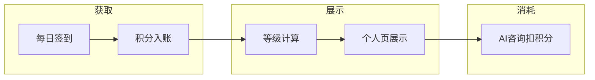

# 宠物关怀积分制度 - 市场调研与 1 周 MVP 压缩方案

## 一、市场调研结论

### 1.1 宠物 APP 积分/会员体系实践

| 产品       | 核心设计                    | 可借鉴点             |
| -------- | ----------------------- | ---------------- |
| **波奇宠物** | 神奇卡/黑卡、V 值等级、波奇豆、邀请返现   | 等级与消费/活跃挂钩，积分可抵现 |
| **爱宠医生** | 积分咨询、邀请 200 积分          | 积分直接绑定核心服务（问诊）   |
| **犬易**   | 白银/黄金/钻石（V 值）、PLUS 付费会员 | 免费等级 + 付费会员双轨    |
| **E 宠**  | 每日签到、积分兑换、会员日           | 签到是基础获客手段        |
| **宠物家**  | 罐头币、宠物 E 卡、邀请 5 折券      | 积分与核心服务（洗护）强绑定   |

### 1.2 行业共识（贝恩、有赞等）

- 会员体系三要素：**会员等级、会员积分、会员权益**
- 积分闭环：**消费/签到/互动/推荐 → 赚积分 → 兑券/权益**
- MVP 建议：小范围测试、先验证核心闭环，再扩展

### 1.3 优化空间

1. **需求文档偏重**：获取途径 15+ 种、消耗场景 12+ 种、10 级等级，对 2 人团队过重
2. **依赖运营能力**：官方精选、热门榜、活动优先、实物兑换等需运营/合作方支撑
3. **与现有能力匹配**：项目已有签到、AI 咨询、发布/评论/点赞，可优先复用

---

## 二、现有代码基础

| 能力       | 状态             | 位置                                                                                                                               |
| -------- | -------------- | -------------------------------------------------------------------------------------------------------------------------------- |
| 用户签到     | 已实现（仅记录，无积分）   | [UserServiceImpl.checkIn](modules/pet-care-core/src/main/java/pvt/mktech/petcare/user/service/impl/UserServiceImpl.java)         |
| 签到统计     | 已实现（连续天数、本月记录） | [UserServiceImpl.getCheckInStats](modules/pet-care-core/src/main/java/pvt/mktech/petcare/user/service/impl/UserServiceImpl.java) |
| 积分/等级展示  | 占位（默认 0/1）     | [UserResponse](modules/pet-care-core/src/main/java/pvt/mktech/petcare/user/dto/response/UserResponse.java)                       |
| AI 咨询    | 已存在            | pet-care-ai 模块                                                                                                                   |
| 发布/评论/点赞 | 已存在            | social 模块                                                                                                                        |

---

## 三、1 周 MVP 功能范围

### 3.1 保留（核心闭环）



| 功能          | 实现要点                                        | 预估   |
| ----------- | ------------------------------------------- | ---- |
| **积分账户**    | 独立 `tb_user_points` 表，不修改原 `tb_user` 表      | 0.5d |
| **签到发积分**   | 在现有 checkIn 后发积分，连续签到递增（10→20→30…，7 天封顶 70） | 0.5d |
| **积分流水**    | `tb_points_log` 记录收支，便于审计与排查                | 0.5d |
| **等级计算**    | 按总积分映射等级，5 级简化版（见下表）                        | 0.5d |
| **AI 咨询消耗** | 调用前扣 10 积分，不足时拦截                            | 1d   |
| **个人页展示**   | 积分、等级、签到入口、流水列表                             | 1d   |

### 3.2 等级简化（5 级）

| 等级  | 总积分       | 称号    | 权益（仅展示）   |
| --- | --------- | ----- | --------- |
| Lv1 | 0-99      | 萌新铲屎官 | 基础功能      |
| Lv2 | 100-499   | 入门铲屎官 | 每日积分上限+50 |
| Lv3 | 500-1499  | 熟练铲屎官 | 内容曝光+10%  |
| Lv4 | 1500-3499 | 资深铲屎官 | 专属标识      |
| Lv5 | 3500+     | 专家铲屎官 | AI 咨询 8 折 |

*权益先做文案展示，逻辑实现放到后续迭代。*

### 3.3 延后迭代（不纳入 1 周）

| 类型   | 内容                                         | 原因           |
| ---- | ------------------------------------------ | ------------ |
| 积分获取 | 完善档案、发布、评论、点赞、被赞、被评、精选、热门、邀请、分享、活动         | 需与多模块联动，开发量大 |
| 积分消耗 | 内容置顶、加精、高级报告、实物/优惠券/虚拟权益、抽奖、优先客服、活动优先、定制模板 | 依赖运营或外部合作    |
| 等级权益 | 曝光权重、积分加成、专属标识逻辑                           | 需推荐/算法支持     |

---

## 四、技术实现要点

### 4.1 数据模型（独立表设计，不修改原表）

```sql
-- 用户积分账户表（独立表，不修改 tb_user）
CREATE TABLE tb_user_points (
  id BIGINT PRIMARY KEY AUTO_INCREMENT COMMENT '主键ID',
  user_id BIGINT NOT NULL COMMENT '用户ID',
  points_balance INT NOT NULL DEFAULT 0 COMMENT '积分余额',
  total_earned INT NOT NULL DEFAULT 0 COMMENT '累计获得积分',
  total_spent INT NOT NULL DEFAULT 0 COMMENT '累计消耗积分',
  created_at DATETIME DEFAULT CURRENT_TIMESTAMP COMMENT '创建时间',
  updated_at DATETIME DEFAULT CURRENT_TIMESTAMP ON UPDATE CURRENT_TIMESTAMP COMMENT '更新时间',
  UNIQUE KEY uk_user_id (user_id),
  INDEX idx_points_balance (points_balance)
) ENGINE=InnoDB DEFAULT CHARSET=utf8mb4 COMMENT='用户积分账户表';

-- 积分流水表（必选）
CREATE TABLE tb_points_log (
  id BIGINT PRIMARY KEY AUTO_INCREMENT COMMENT '主键ID',
  user_id BIGINT NOT NULL COMMENT '用户ID',
  change_amount INT NOT NULL COMMENT '变动值，正为收入负为支出',
  balance_before INT NOT NULL COMMENT '变动前余额',
  balance_after INT NOT NULL COMMENT '变动后余额',
  source VARCHAR(50) NOT NULL COMMENT '来源：check_in, ai_chat, ...',
  source_id BIGINT DEFAULT NULL COMMENT '来源关联ID',
  description VARCHAR(200) DEFAULT NULL COMMENT '描述',
  created_at DATETIME DEFAULT CURRENT_TIMESTAMP COMMENT '创建时间',
  INDEX idx_user_id (user_id),
  INDEX idx_created_at (created_at),
  INDEX idx_source (source)
) ENGINE=InnoDB DEFAULT CHARSET=utf8mb4 COMMENT='积分流水表';
```

**设计说明**：

- `tb_user_points` 与 `tb_user` 通过 `user_id` 关联，一对一关系
- 首次使用积分功能时自动创建账户（懒加载）
- 查询用户信息时 JOIN 或单独查询积分表
- `total_earned` 用于等级计算（总积分 = total_earned），避免每次统计流水表
- 积分变动时同时更新 `points_balance` 和对应的累计字段（`total_earned` 或 `total_spent`）
- 流水表记录每次变动的详细信息，便于审计和排查问题

### 4.2 签到积分规则（简化）

- 第 1 天：10，第 2 天：20，…，第 7 天及以后：70
- 断签重置为第 1 天
- 复用现有 `getCheckInStats` 的 `continuousDays`

### 4.3 积分账户初始化

- 在查询用户积分时，如果 `tb_user_points` 中不存在记录，自动创建账户（points_balance=0）
- 或在用户首次签到/使用积分功能时创建账户

### 4.4 AI 咨询扣费

- 在 [ChatController](modules/pet-care-ai/src/main/java/pvt/mktech/petcare/chat/controller/ChatController.java) 或对话入口处，调用 core 的扣积分接口
- 扣费成功后再放行 AI 调用；失败返回「积分不足」提示
- 扣费时需先查询 `tb_user_points`，确保余额充足，使用事务保证一致性

### 4.5 跨服务调用

- pet-care-ai 调用 pet-care-core 的扣积分接口（HTTP 或内部 RPC）
- 需确认现有服务间调用方式（Feign / RestTemplate / 同库等）
- 若同库，可考虑 core 提供扣积分 Service 供 ai 模块直接调用

---

## 五、排期建议（2 人 × 5 工作日）

| 角色  | Day1         | Day2       | Day3        | Day4      | Day5     |
| --- | ------------ | ---------- | ----------- | --------- | -------- |
| 后端  | 积分表+流水+签到发积分 | 等级计算+扣积分接口 | AI 咨询扣费联调   | 流水查询+异常处理 | 联调+修 Bug |
| 前端  | 个人页积分/等级展示   | 签到入口+流水列表  | AI 咨询积分不足提示 | 联调        | 联调+修 Bug |

---

## 六、风险与应对

| 风险                | 应对                                                     |
| ----------------- | ------------------------------------------------------ |
| AI 与 Core 跨服务调用复杂 | 若同库，可考虑 core 提供扣积分 Service 供 ai 模块直接调用                 |
| 积分并发（签到/扣费）       | 使用 Redis 分布式锁或 DB 乐观锁，避免超扣；扣费时使用 SELECT FOR UPDATE 锁定行 |
| 积分账户不存在           | 懒加载创建账户，查询时自动初始化                                       |
| 等级权益文案与实现不一致      | 明确标注「即将上线」，避免用户误解                                      |

---

## 七、后续迭代优先级建议

1. **P1**：完善档案、发布内容、评论、点赞 发积分（与现有 social 模块联动）
2. **P2**：邀请新用户 200 积分（需邀请关系链）
3. **P3**：内容置顶、虚拟权益等消耗场景
4. **P4**：等级权益的真实逻辑（曝光权重、积分加成等）

---

## 八、差异化功能：宠物成长时光轴（Milestone Timeline）

### 8.1 核心价值

记录宠物成长的重要时刻，形成可视化的成长轨迹，强化用户与宠物的情感连接。相比竞品聚焦健康记录和商城，成长时光轴更注重**陪伴见证**和**情感记忆**，体现"宠物关怀"的差异化定位。

### 8.2 功能设计

#### 8.2.1 里程碑类型

| 类型 | 说明 | 示例 |
|------|------|------|
| **首次类** | 宠物第一次经历的重要事件 | 首次洗澡、首次出门、首次打疫苗、首次体检 |
| **健康类** | 健康相关的重要节点 | 疫苗完成、绝育手术、康复记录 |
| **成长类** | 技能和行为发展 | 学会新技能、适应新环境、搬家适应 |
| **社交类** | 与其他宠物/人的互动 | 新伙伴加入、第一次见面 |
| **纪念类** | 特殊纪念日 | 生日、领养纪念日、到家X天 |
| **自定义** | 用户自定义重要时刻 | 任意用户认为重要的时刻 |

#### 8.2.2 记录方式

- **照片/视频**：支持上传1-9张照片或1段视频
- **文字描述**：必填标题，可选详细描述
- **时间记录**：自动记录创建时间，支持手动调整时间（用于补录历史时刻）
- **标签分类**：选择里程碑类型，便于筛选和统计

#### 8.2.3 展示形式

- **时间轴视图**：纵向时间轴，按时间倒序展示所有里程碑
- **筛选功能**：按里程碑类型、年份、月份筛选
- **统计信息**：自动计算"陪伴X天"、"已记录X个重要时刻"
- **纪念卡片**：重要节点（如生日、到家1周年）自动生成精美纪念卡片，可分享到社区

#### 8.2.4 与积分体系结合

- 完成里程碑记录：+30积分（鼓励用户记录）
- 分享里程碑到社区：+10积分（增加社区活跃度）
- 连续记录里程碑（每月至少3个）：+50积分（培养记录习惯）

### 8.3 差异化优势

1. **情感价值**：从"健康管理"升级为"陪伴见证"，增强用户粘性
2. **视觉化展示**：时间轴形式直观展示成长轨迹，比列表更有感染力
3. **社交传播**：纪念卡片可分享，形成UGC内容，带动社区活跃
4. **竞品空白**：主流宠物APP多聚焦商城/问诊，缺少成长记录功能

### 8.4 技术实现

#### 8.4.1 数据模型

```sql
-- 宠物里程碑表
CREATE TABLE tb_pet_milestone (
  id BIGINT PRIMARY KEY AUTO_INCREMENT COMMENT '主键ID',
  pet_id BIGINT NOT NULL COMMENT '宠物ID',
  user_id BIGINT NOT NULL COMMENT '用户ID',
  milestone_type VARCHAR(50) NOT NULL COMMENT '里程碑类型：first_bath, first_outdoor, vaccine, birthday, custom等',
  title VARCHAR(200) NOT NULL COMMENT '标题',
  description TEXT COMMENT '详细描述',
  milestone_time DATETIME NOT NULL COMMENT '里程碑发生时间',
  media_urls JSON DEFAULT NULL COMMENT '媒体文件URL列表（照片/视频），JSON数组格式',
  is_shared TINYINT DEFAULT 0 COMMENT '是否分享到社区：0-未分享，1-已分享',
  created_at DATETIME DEFAULT CURRENT_TIMESTAMP COMMENT '创建时间',
  updated_at DATETIME DEFAULT CURRENT_TIMESTAMP ON UPDATE CURRENT_TIMESTAMP COMMENT '更新时间',
  is_deleted TINYINT DEFAULT 0 COMMENT '逻辑删除：0-正常，1-已删除',
  deleted_at DATETIME DEFAULT NULL COMMENT '删除时间',
  INDEX idx_pet_id (pet_id),
  INDEX idx_user_id (user_id),
  INDEX idx_milestone_time (milestone_time),
  INDEX idx_milestone_type (milestone_type),
  INDEX idx_deleted (is_deleted)
) ENGINE=InnoDB DEFAULT CHARSET=utf8mb4 COMMENT='宠物里程碑表';
```

#### 8.4.2 复用现有能力

- **图片上传**：复用 `OssTemplate.uploadAvatar()` 或扩展为通用上传方法
- **时间记录**：复用现有时间处理逻辑
- **社交分享**：与现有 `Post` 表关联，里程碑分享时创建一条动态

#### 8.4.3 新增功能点

- **时间轴组件**：前端实现纵向时间轴UI组件
- **纪念卡片生成**：重要节点（生日、周年）自动生成卡片，可复用图片处理能力
- **统计计算**：计算"陪伴天数"（当前时间 - 宠物创建时间）

### 8.5 实施优先级

- **P0（MVP，1-2周）**：基础记录功能（创建、查看、时间轴展示）
- **P1（2-3周）**：分享到社区、纪念卡片生成
- **P2（3-4周）**：筛选统计、高级展示效果

### 8.6 与积分体系联动

| 行为 | 积分奖励 | 说明 |
|------|----------|------|
| 记录里程碑 | +30 | 每次记录重要时刻 |
| 分享里程碑到社区 | +10 | 增加社区内容 |
| 每月记录≥3个里程碑 | +50 | 培养记录习惯 |
| 完成"首次类"里程碑 | +20 | 鼓励记录重要节点 |

*注：里程碑积分计入积分体系，可用于等级提升和AI咨询消耗。*
